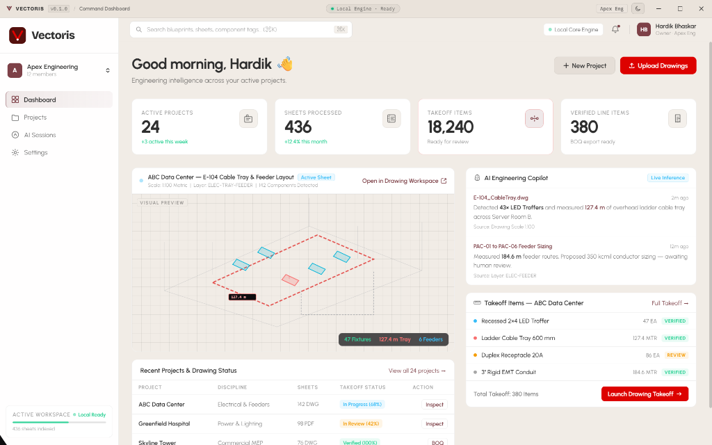

# Vectoris — AI-Native Engineering & Blueprint Takeoff Workstation

Official public release distribution and architecture showcase for the **Vectoris Engineering Workstation**.

> **Vectoris** is an advanced engineering workstation and project intelligence platform engineered for electrical estimators, MEP (Mechanical, Electrical, Plumbing) coordinators, and preconstruction teams. Combining a local-first desktop runtime with vision-language neural perception models, Vectoris automates the labor-intensive discipline of construction drawing takeoff, quantity calculation, and Bill of Quantities (BOQ) synthesis directly from native architectural drawings without exposing confidential project IP to uncontrolled third-party cloud infrastructure.

---

## 📑 Complete System Documentation

Read the full technical specification and architectural deep dive:
👉 **[Full Architecture & Engineering Documentation](./assets/description.md)**

---

## ⚡ Core Architecture

- **Desktop Shell**: Tauri v2 Core (Rust 2021 + WebView2) with custom frameless window management and sub-95MB idle RAM footprint.
- **Frontend Workstation**: React 19, Vite 7, TypeScript Strict, TailwindCSS.
- **Perception & Takeoff**: On-device vector parsing for DWG/PDF blueprints, multi-modal neural symbol classification, and linear conduit/cable-tray takeoff.
- **Security Posture**: Local-first zero-telemetry architecture, strict Content Security Policy (CSP), and cryptographic release verification.
- **Update Verification**: Minisign Ed25519 cryptographic signature verification on all binaries.

---

## 📦 Downloads & Releases

Official installer packages and signed binaries are published under [Releases](https://github.com/VectorisAI/Vectoris/releases).

- **Windows Installer (NSIS Setup)**: `Vectoris_<version>_x64-setup.exe`
- **Windows Enterprise MSI**: `Vectoris_<version>_x64_en-US.msi`
- **Update Manifest**: `latest.json`

---

## 🔒 Cryptographic Release Trust Model

All release artifacts are cryptographically signed using Ed25519 keys. The installed Vectoris workstation automatically verifies signatures against the embedded public key before initiating the in-app update handoff.

---

## 📄 License

Proprietary Enterprise Software. Copyright (c) 2026 Vectoris AI Inc. All rights reserved.
