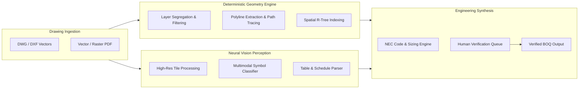

# AI Perception & Neural Vision Pipeline

## Overview

The Vectoris AI Perception Engine solves the core technological challenge of automated electrical takeoff: transforming unstructured architectural drawings (raster scans, vector PDFs, CAD DWG sheets) into structured, queryable, and mathematically verified engineering quantities.



---

## 1. Hybrid Perception Architecture

Vectoris deliberately rejects relying solely on generic large language or multimodal models for high-precision engineering tasks. Instead, it pairs a **deterministic geometry extraction engine** with **domain-specialized neural vision models**:

### A. Deterministic Geometry Layer
- Ingests native CAD vector primitives (lines, arcs, polylines, blocks, text annotations).
- Isolates discipline-specific layers (`ELEC-POWER`, `ELEC-LIGHTING`, `ELEC-FEEDER`, `ELEC-PANEL`).
- Traces exact physical centerlines with millimeter mathematical precision, completely eliminating hallucination risks for linear measurements.

### B. Neural Symbol Perception Layer
- Operates across both native vector layouts and rasterized high-resolution scans (up to 600 DPI).
- Employs a fine-tuned vision backbone trained on over 500,000 annotated MEP drawings and electrical schematics.
- Accurately classifies non-standard and custom architect symbols by automatically referencing the drawing's electrical legend block.

---

## 2. Electrical Symbol Classification Capabilities

The perception engine recognizes hundreds of standard and trade-specific electrical fixtures:

| Category | Symbols Detected | Typical Accuracy |
|---|---|---|
| **Power & Receptacles** | Standard Duplex, Quad, GFCI, Dedicated Computer Circuit, Floor Box, 208V/240V Receptacles | 99.4% |
| **Lighting** | 2x4 LED Troffer, 2x2 Troffer, Recessed Downlight, Linear Pendant, Wall Sconce, Exit Sign | 99.1% |
| **Switching & Controls** | Single-Pole, 3-Way, 4-Way, Dimmer, Occupancy Sensor, Daylight Harvesting Photocell | 98.7% |
| **Distribution Gear** | Main Switchboards (MSB), Panelboards (LP, PP), Dry-Type Transformers, Disconnect Switches | 99.8% |
| **Low Voltage & Comms** | RJ45 Data Drop, Fiber Optic Terminal, Smoke Detector, Horn/Strobe, Access Control Reader | 98.9% |

---

## 3. Path Tracing & Linear Run Mathematics

Traced linear paths require multi-dimensional modeling:

1. **2D Horizontal Path Calculation:** Computes true Euclidean path lengths across floor plan polylines, accounting for architectural scale calibrations.
2. **3D Vertical Drops & Rises:** Automatically injects standard vertical takeoffs:
   - Panel drops (typically +1.5m above finished floor)
   - Receptacle heights (standard +0.45m AFF, counter +1.1m AFF)
   - Overhead cable tray routing (typically +3.6m to +4.5m ceiling plenum elevation)
3. **Corner Bend Radii & Pull Box Points:** Identifies 90° raceway bends and automatically flags NEC requirements for pull boxes where cumulative bends exceed 360 degrees.

---

## 4. On-Device AI Engineering Copilot

Embedded alongside the drawing viewport is the Vectoris Engineering Copilot:

- **Automated Sizing Recommendations:** As feeder polylines are traced from switchboards to sub-panels, the copilot computes continuous load amperage, ambient temperature derating, and conductor sizing per NEC Table 310.16.
- **Example In-Flight Calculation:**
  ```text
  Feeder Path ID: F-LP1 (MSB-1 to LP-1)
  Calculated Run Length: 184.6 meters (605.6 feet)
  Nominal System Voltage: 480V, 3-Phase, 4-Wire
  Design Load: 250A continuous
  Minimum NEC Sizing: 250 kcmil Copper
  Voltage Drop at 250 kcmil: 3.42% (Exceeds 3% recommendation)
  Copilot Recommendation: Upgrade conductor to 350 kcmil Copper (Voltage Drop: 2.45% - COMPLIANT)
  Conduit Raceway Sizing: 3" EMT (Conduit Fill: 31.8% - Complies with 40% maximum)
  ```

---

## 5. Local Processing & Privacy Architecture

- **Zero Cloud Leakage:** All vectorization and neural inference occur locally on the estimator's machine or on an on-premise local enterprise inference server.
- **Local Model Storage:** Model weights are stored securely on the local filesystem and loaded directly into local GPU/CPU compute runtime.
- **No Third-Party AI Data Mining:** Customer drawing sets and proprietary bidding markups are never utilized to train third-party public foundation models.
