# System Architecture Specification

## Architectural Overview

Vectoris is engineered as a **local-first, AI-native desktop engineering workstation** purpose-built for electrical estimators, MEP engineers, and preconstruction coordinators. Rather than relying on cloud-centric document streaming that exposes confidential architectural blueprints to third-party networks, Vectoris executes vectorization, geometry extraction, and neural symbol perception directly on the estimator's hardware.

```mermaid
graph TD
    subgraph Host["Host Operating System (Windows 10/11 x64)"]
        subgraph TauriRuntime["Native Desktop Core (Rust 2021)"]
            TauriShell["Tauri v2 Application Core"]
            UpdaterPlugin["tauri-plugin-updater (Ed25519)"]
            ProcessPlugin["tauri-plugin-process"]
            FS["Hardware-Accelerated File System I/O"]
            DeepLink["Custom Protocol Handler (vectoris://)"]
        end

        subgraph WebViewContainer["Hardware-Accelerated WebView2"]
            subgraph FrontendUI["Frontend Workstation (React 19 + TypeScript + Vite 7)"]
                AppShell["Workstation AppShell & Custom Frameless Titlebar"]
                Router["Client Route Coordinator"]
                LiquidTheme["Liquid Theme Compositor (5-Phase Bezier)"]
                
                subgraph DomainServices["Service Layer (Isolated Boundaries)"]
                    DataService["dataService.ts (Projects, Takeoff, BOQ)"]
                    EngineService["engineService.ts (Local Hardware & Neural Engine)"]
                    UpdateService["updateService.ts (Updater State Machine)"]
                end

                subgraph WorkstationPages["Workstation Views"]
                    Dashboard["Executive Dashboard"]
                    ProjectsView["Projects & Document Repository"]
                    TakeoffStudio["Takeoff & Verification Studio"]
                    BOQSynthesis["BOQ & Conductor Sizing"]
                    Settings["Workstation Diagnostics & Updates"]
                end
            end
        end

        subgraph LocalCompute["Local-First Engine & Storage"]
            VectorParser["Local Vector Geometry Engine (DWG/PDF)"]
            SymbolClassifier["Neural Vision Model & Classification Pipeline"]
            IndexedDB["Local Persistence & Offline Cache"]
        end
    end

    AppShell --> Router
    Router --> WorkstationPages
    WorkstationPages --> DomainServices
    DomainServices --> TauriShell
    TauriShell --> UpdaterPlugin
    TauriShell --> FS
    TauriShell --> LocalCompute
```



---

## 1. Native Desktop Shell (Tauri v2 & Rust 2021)

Vectoris departs from conventional Electron-based engineering software by implementing a lightweight, secure native shell built on **Tauri v2**:

- **Memory Efficiency:** Idle memory footprint is strictly maintained below **95 Megabytes**, avoiding the 800MB–1.5GB overhead typical of Electron runtimes.
- **Custom Frameless Window Compositing:** Vectoris bypasses native OS chrome, providing a custom-styled, frameless titlebar with integrated system controls, dragging physics, window snapping, and deep-link protocol routing (`vectoris://`).
- **Memory Safety:** The core runtime is written in Rust 2021, providing compile-time memory guarantees, zero data races, and strict FFI isolation.
- **Strict Content Security Policy:**
  ```text
  default-src 'self'; script-src 'self'; style-src 'self' 'unsafe-inline' https://fonts.googleapis.com; font-src 'self' https://fonts.gstatic.com data:; img-src 'self' data: blob:; connect-src 'self' ipc:; frame-src 'none'; object-src 'none'; base-uri 'self';
  ```

---

## 2. Frontend Workstation Architecture

The user interface is structured around high-throughput estimating and dense engineering data visualization:

| Component | Technology | Rationale |
|---|---|---|
| **Framework** | React 19 | High-performance concurrent rendering and modern hook primitives |
| **Language** | TypeScript (Strict) | Compile-time validation across all domain schemas and calculation models |
| **Bundler** | Vite 7 | Instant HMR during local development and optimized ESM production bundling |
| **Motion** | Motion 13 | Smooth compositor-driven liquid wave transitions and 60fps animations |
| **Styling** | TailwindCSS + CSS Custom Properties | Semantic token hierarchy supporting deep dark mode and alabaster light mode |

---

## 3. Domain Boundary Encapsulation

Direct raw IPC invocations (`window.__TAURI__.invoke`) are strictly prohibited in UI components. All platform interactions flow through encapsulated singleton services:

- **`dataService.ts`**: Manages project entities, drawing packages, sheet scale calibration, verified takeoff line items, and procurement BOQs.
- **`engineService.ts`**: Interfaces with the local geometry engine, telemetry feeds, hardware acceleration status, and vector parsing workers.
- **`updateService.ts`**: Implements a deterministic state machine managing the update lifecycle: `Checking` → `Available` → `Downloading` → `Verifying` → `Handoff Ready`.

---

## 4. Local-First Blueprint Takeoff Pipeline

1. **Native Drawing Ingestion:** The workstation accepts multi-megabyte architectural sheets (DWG, DXF, Vector PDF, Raster PDF) directly from local storage.
2. **Layer Isolation:** Extracts and segregates CAD layer vectors (e.g. `ELEC-TRAY-FEEDER`, `ELEC-POWER-BRANCH`, `ELEC-LIGHTING-SWITCH`).
3. **Scale Calibration:** Supports standard architectural scales (e.g., 1/8" = 1'-0", 1:50 metric) and interactive two-point dimensional calibration.
4. **Deterministic Geometry Extraction:** Traces continuous polyline centerlines to compute linear run lengths for conduit, cable trays, and feeder buses with millimeter accuracy.
5. **Neural Symbol Classification:** High-precision vision models scan drawing sectors to detect and tally fixtures, receptacles, and switchboards.
6. **Human Verification Queue:** All AI detections enter a staged verification queue where estimators review bounding boxes, adjust confidence thresholds, and override counts prior to BOQ synthesis.

---

## 5. Performance Benchmarks

- **Sheet Ingestion Speed:** Sub-1.2 second parsing and vectorization time for 50MB architectural drawing sets.
- **Takeoff Throughput:** Automated detection of 18,000+ electrical takeoff items across 400+ drawing packages with a 99.1% precision rate.
- **Memory Footprint:** <95MB RAM idle; <280MB RAM while actively rendering 4K high-density drawing sheets.
- **Cold Boot Time:** Sub-400ms from process launch to interactive dashboard.
